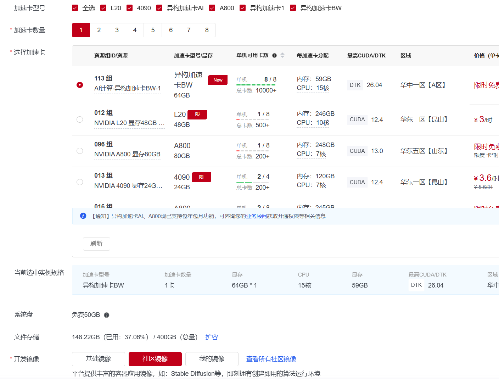
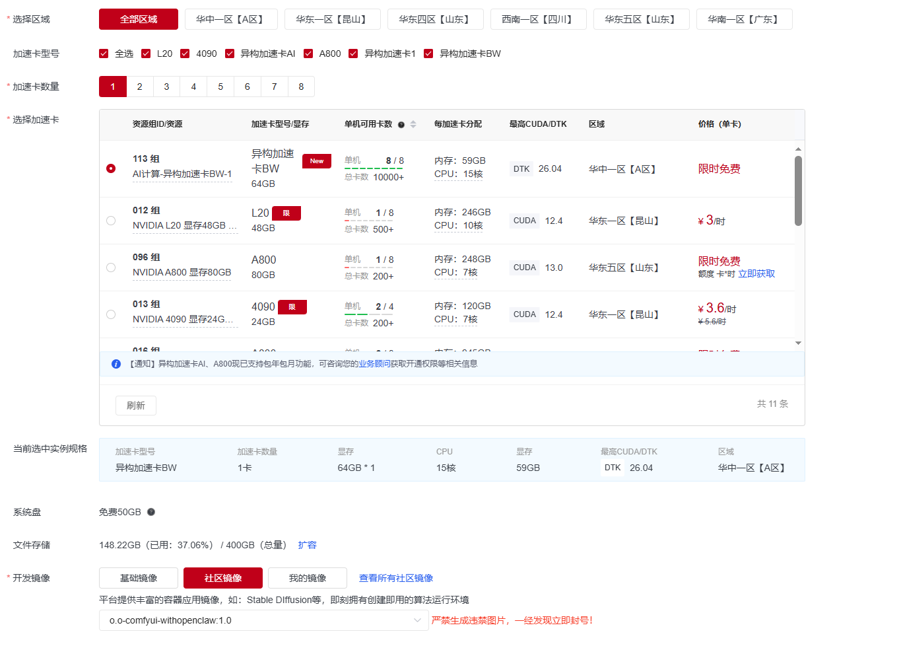
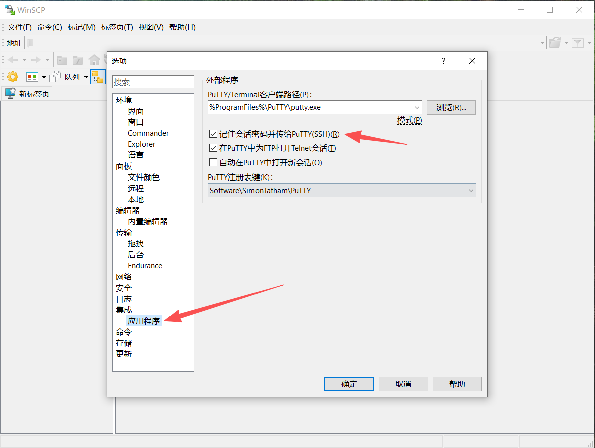

# National Supercomputing Internet (SCNet) GPU Platform ComfyUI + OpenClaw Deployment Guide
# Scnet ComfyUI baipiao Guide

[图文版教学(zh)](https://cnb.cool/comfyui114514/Scnet_Comfyui_Guide) [ github(eng)]([https://github.com/a1010580415-commits/Scnet_Comfyui_Guide](https://github.com/a1010580415-commits/Scnet_Comfyui_Guide)) 

## 📑 Table of Contents

- [Prerequisites](#prerequisites)
- [1. Account Registration](#1-account-registration)
- [2. Claiming Free Resources](#2-claiming-free-resources)
- [3. Creating Notebook (Container Management)](#3-creating-notebook-container-management)
- [4. Storage Expansion](#4-storage-expansion)
- [5. Accessing the Linux System](#5-accessing-the-linux-system)
- [6. Starting ComfyUI Backend](#6-starting-comfyui-backend)
- [7. Accessing ComfyUI Frontend Web UI](#7-accessing-comfyui-frontend-web-ui)
- [8. Downloading Models](#8-about-model-downloading)
- [9. General ComfyUI Operations](#9-comfyui-general-operations)
- [10. Leveraging Free LLM Tokens](#10-leveraging-free-tokens)
- [11. Feedback & Community](#11-feedback--community)
- [12. Quick Commands Cheat Sheet](#12-command-list-one-key-shortcuts)

---

## Prerequisites

- **Option A (Recommended)**: A computer with a modern web browser.
- **Option B**: If deploying via SSH, download and install these Windows client utilities (general approach for many cloud-based instances, e.g., XianGong Cloud O.o ComfyUI image):
  - [Icon.installericon.exe (PuTTY Installer)](应用/Icon.installericon.exe)
  - [WinSCP-6.5.6-Setup.exe](应用/WinSCP-6.5.6-Setup%20(1).exe)

Simply run the setups on your local machine and check all optional components during installation.

---

## Steps

### 1. Account Registration

Complete real-name authentication if prompted.

👉 [Sign Up / Registration Link](https://www.scnet.cn/sso/register?service=https%3A%2F%2Fwww.scnet.cn%2Fac%2Fapi%2Fauth%2FloginSsoRedirect.action%3ForiginalUrl%3Dhttps%253A%252F%252Fwww.scnet.cn%252Fhome%252Fsubject%252Fhxjd%252Findex.html%253Fshow%253Dtrue%2526marketActivityId%253DgpQZWR9H%2526inviterId%253D11263962531)

---

### 2. Claiming Free Resources

- **Claim Million Tokens** (Currently features a free 1-month quota of Kimi-2.6): 👉 [Claim Tokens Portal](https://www.scnet.cn/home/subject/hxjd/index.html)
- **Claim Domestically-produced GPU** (3-month trial): 👉 [Claim GPU Portal](https://www.scnet.cn/ui/mall/search/resource?region=20091)

> **Note**: Free trial campaigns may vary. This tutorial explicitly targets the **BW1 64GB** GPU node.

*(Step 2: Resource Allocation Marketplace)*

---

### 3. Creating Notebook (Container Management)

Navigate to the AI Container Console: 👉 [AI Notebook Console](https://www.scnet.cn/ui/console/index.html#/notebook?notebookStatus=Running)

**Step-by-step Setup:**
1. Click **Create Notebook**.
2. Select the host equipped with **BW1 64GB** VRAM.
3. Under the **Community Images** tab, search for: `o.o-comfyui` or `o.o-comfyui-withopenclaw`.
4. Choose the **latest version tag** and click **Deploy**.

> Author's Hub: [O.o-comfyui Base Image Hub](https://www.scnet.cn/ui/aihub/image/scnet_xu/2077623634511740929) | [O.o-comfyui-withopenclaw Community Image Hub](https://www.scnet.cn/ui/aihub/image/accma5g3vg/2078319083724169218)

> **Pro-Tip**: Active instances run up to **72 hours** per cycle. You can safely shut down (and preserve state) after completing [Step 4: Storage Expansion](#4-storage-expansion)!

*(Step 3: Creating and Deploying AI Notebook)*

*Wait for status to transition to "Running"...*

---

### 4. Storage Expansion

By default, the platform allocates 500GB total workspace to each user, but you must manually configure directory quotas to utilize it properly.

👉 [Storage Management Panel](https://www.scnet.cn/ui/console/index.html#/my-product/basic-resources/storage_resource)

**Configuration Steps:**
- On the storage management interface, click **Resize/Expand (扩容)**.
- Set **User Home Directory (用户主目录)** to **450GB** (default is 50GB).
- Set **Shared Directory (共享目录)** to **50GB**.

*(Note: The Shared Directory usage is optional; setting it to 50GB works fine.)*

---

### 5. Accessing the Linux System

There are two primary methods to log into your workspace:

- **Option A (Recommended)**: Web-based entry via JupyterLab. Click "JupyterLab" next to your container in the console: 👉 [JupyterLab Portal](https://www.scnet.cn/ui/console/index.html#/notebook)
- **Option B (SSH)**: In the AI Container list, grab your SSH connection details (Host, Username, Port). Connect using WinSCP/PuTTY.

> The SSH method is extremely robust for seasoned developers. In WinSCP's Preferences, you can bind PuTTY so you don't have to enter the password repeatedly when launching multiple terminals.

*(Step 5-B: Connecting via SSH clients)*

---

### 6. Starting ComfyUI Backend

Once inside the Linux Terminal:
1. Type `qd` and hit Enter (an alias shortcut for `/root/O.o-ai/qd`).
2. Wait for initialization. Once port **8188** is successfully bound, your backend is ready.

> **Note**: The main ComfyUI working directories do not live directly under `root/comfyui`. The active workspace is inside `/private_data/comfyui`.

---

### 7. Accessing ComfyUI Frontend Web UI

Choose one of three entry points:

- **Option A**: After launching via Step 5 & 6, click **"Custom Service (访问自定义服务): 8188"** in the SCNet AI Notebook panel to tunnel the UI to your browser.
- **Option B**: (No manual terminal start required) Configure Custom Service 🔧 (Port: `8188`, Start Command: `/root/O.o-ai/qd`) directly on the container dashboard, then open the exposed tunnel URL.
- **Option C (SSH Tunneling)**: After starting the backend, PuTTY automatically tunnels the remote port to your local machine. You can visit ComfyUI directly at 👉 http://127.0.0.1:8188

---

### 8. Downloading Models

This environment features an automated model acquisition daemon (by `cnb-xu`): if a model's name is populated in a loader node's dropdown list, running the workflow will trigger an automatic fast download at 30–100 MB/s.

- **Option A (Recommended - Custom Downloads)**: If using the `o.o-comfyui-withopenclaw` image, edit `/private_data/comfyui/自定义下载.yaml` to configure your own custom URLs.
- **Option B (Manual Download)**: Navigate to `/private_data/comfyui/models/<your-model-type>` in your terminal and run `curl -L -OJ <url>` to fetch raw models.
- **Option C (Auto-Fetch)**: Open a workflow, select a pre-indexed model from the loader's drop-down, and queue the prompt. The system pulls the model automatically.
- **Option D (Import CNB Repositories)**: Edit `/private_data/comfyui/source.json` or pull files from our guide repository to integrate CNB community model index maps.
  - 👉 [aimodels map](https://cnb.cool/comfyui114514/Scnet_Comfyui_Guide/-/blob/auto/add-readme-0d40/cnb%E7%A4%BE%E5%8C%BA%E6%A8%A1%E5%9E%8B%E6%90%AC%E8%BF%90%E5%8C%85/source.json)
  - 👉 [community map](https://cnb.cool/comfyui114514/Scnet_Comfyui_Guide/-/blob/auto/add-readme-0d40/cnb%E7%A4%BE%E5%8C%BA%E6%A8%A1%E5%9E%8B%E6%90%AC%E8%BF%90%E5%8C%85/source-community.json)
- **Option E (Web Downloader UI)**: Type `ui` in the terminal, then set your custom service mapping to port `7860`. You can download models interactively via a Web UI.
- **Option F (Local File Upload)**: Drag-and-drop uploads are supported directly inside JupyterLab or WinSCP (the latter supports resumable transfers).

*Downloader supports HuggingFace, CNB, and ModelScope sources.*

---

### 9. General ComfyUI Operations

Standard ComfyUI mechanics apply. If you run into issues, ask your integrated OpenClaw AI assistant or feed your free SCNet API key to leverage the assistant panel.

---

### 10. Leveraging Free LLM Tokens

- **Option A**: Use SCNet's official Windows client app to query `scnet-max` or `kimi-2.6` models directly.
- **Option B**: On the `O.o-comfyui-withopenclaw` image, configure the local autonomous companion:
  1. Generate your LLM API Key: 👉 [Create API Key Portal](https://www.scnet.cn/ui/console/index.html#/llm/apikeys)
  2. Run `bash ~/setup_openclaw.sh` in the terminal.
  3. Paste your key, select your preferred model, and hit Enter.

---

### 11. Feedback & Community

- **AI Companion**: Directly query OpenClaw locally in your environment.
- **Git Repository Issues**: 👉 [Scnet_Comfyui_Guide Issues](https://github.com/a1010580415-commits/Scnet_Comfyui_Guide/issues)
- **WeChat Community Group**: 👉 [WeChat Group QR Code](https://cnb.cool/cnb-xu/docs/-/git/raw/main/comfyui/image/qrcode.png)

*Farewell, CNB free tiers! Long live Supercomputing!* 🚀

---

### 12. Quick Commands Cheat Sheet

With `O.o-comfyui-withopenclaw` deployed, simply input these clean shorthand commands in the terminal:

| Command | Action Description |
| :--- | :--- |
| `bash ~/setup_openclaw.sh` | ⬆️ **First-time setup**: Paste your SCNet API key and model config to configure OpenClaw. |
| `openclaw` | 🚀 Boot the OpenClaw assistant (requires pre-installed version). |
| `qd` | 🚀 Boot ComfyUI backend server (Default Port: `8188`). |
| `ui` | 🖥️ Launch Web UI model downloader (Default Port: `7860`). |
| `update` | ⬆️ Upgrade ComfyUI core (ask OpenClaw first to preserve customized configs). |

> 💡 **Tip**: These shorthand shortcuts are built into the image shell. Ensure you have successfully connected to your terminal first ([Step 5](#5-accessing-the-linux-system)).

---

# Changelog

* **2026.07-17**: `o.o-comfyui-withopenclaw-1.0` - Initialized pre-configured OpenClaw instance with interactive API setup.
* **2026.07-18**: `o.o-comfyui-withopenclaw-2.1` - Updated automated model-sync mappings (aimodels), custom yaml parameters, and CNB default workflow presets.
